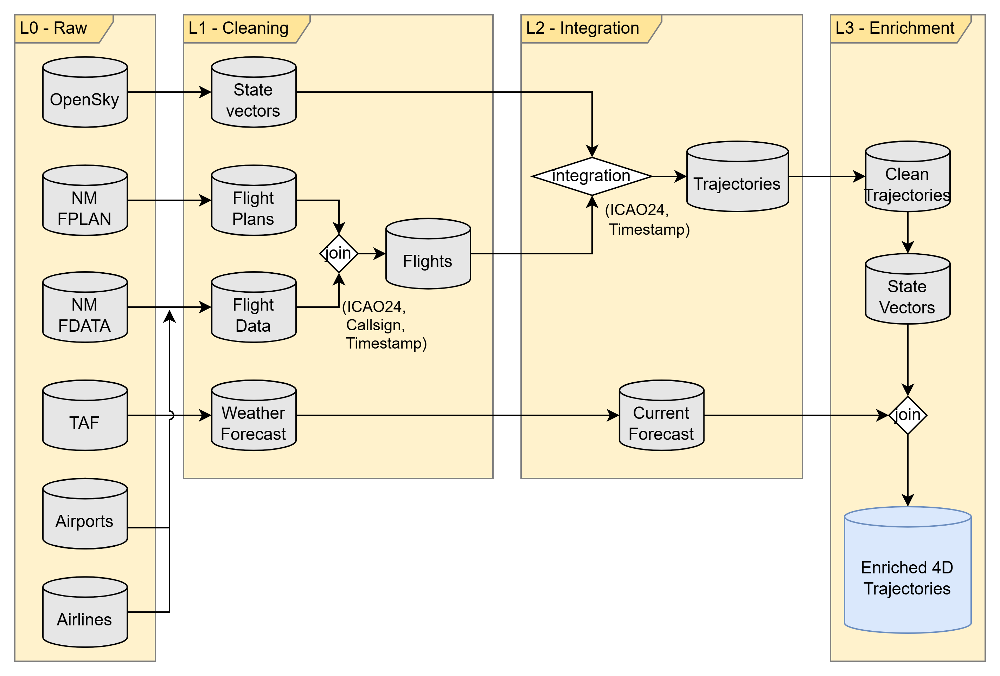

# Documentation index

## Overview of the data workflow

<figure align="center" >

<figcaption></figcaption>
</figure>

The implementation of the designed ETL process is structured in five blocks:

- Data extraction:
- Data cleaning:
- Data integration:
- Trajectory processing:
- Metrics and evaluation:

Each of these steps is implemented as a sub-package of the `trajectoryProcessing` package.

## Data description

### 4D trajectories

[4D trajectories](./4d_trajectories.md)

### Raw data
- [OpenSky Network](./raw_data/opensky_network.md)
    - [State vectors](./raw_data/opensky_network.md#state-vectors)
    - [OpenSky flights API](./raw_data/opensky_network.md#flights-api)
- [Eurocontrol's Network Manager](./raw_data/network_manager.md)
    - [Flight plans](./raw_data/network_manager.md#flight-plans)
    - [Flight data](./raw_data/network_manager.md#flight-data)
    - [Aviation Data Repository for Research (ADRR)](./raw_data/network_manager.md#adrr-flight-data)
- [Terminal Area Forecasts (TAF)](./raw_data/terminal_area_forecast.md)

## Workflow implementation

<figure>

<figcaption>
Overview of the data workflow.
</figcaption>
</figure>

- [Directory organization](./pipeline/folder_structure.md)
- [Cleaning pipeline](./pipeline/cleaning.md)
- [Integration pipeline](./pipeline/integration.md)
- [Enriched 4D pipeline](./pipeline/enrichment.md)

## Data quality

- [Individual sources](./data_quality/individual_sources.md)
- [4D Trajectories](./data_quality/4dtrajectories.md)
- [Metrics](./data_quality/quality_metrics.md)

## Visualization

- [Data visualization](./visualization.md)