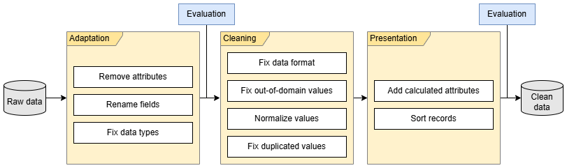

# Data Cleaning (L1)

This document specifies the **L1 cleaning stage** of the pipeline. At this stage, each source is processed **independently** to transform raw inputs (L0) into standardized and validated datasets, without cross-source joins.

Raw-source structure and semantics are documented under `docs/raw_data/`.

<figure>

<figcaption>
Overview of the cleaning pipeline.
</figcaption>
</figure>

---

## Scope of L1 cleaning

L1 guarantees per-source consistency through:

- canonical column naming,
- deterministic type conversion,
- temporal normalization to UTC-aware semantics,
- invalid-record filtering,
- duplicate handling,
- deterministic ordering and source-specific consolidation rules.

---

## OpenSky Network — State Vectors (`surveillance.py`)

### Schema normalization

- Drop unused columns: `sensors`, `spi`, `position_source`, `origin_country`.
- Rename OpenSky fields to canonical names (`hexid` → `icao24`, `track` → `true_track`, etc.).
- Localize `time_position` and `last_contact` to UTC and truncate to second resolution.

### Cleaning rules

- Remove rows with missing `icao24` or invalid/missing geospatial coordinates.
- Remove duplicates on (`icao24`, `time_position`, `latitude`, `longitude`).
- Normalize `icao24`/`callsign` to uppercase.
- Trim callsign spaces, remove callsigns containing embedded blanks, and convert empty strings to null.
- Sort by (`icao24`, `time_position`).

### Derived columns and output contract

- `timestamp := time_position`
- `altitude := geo_altitude`
- Output fixed column order:
  `timestamp`, `icao24`, `callsign`, `time_position`, `last_contact`, `latitude`, `longitude`, `altitude`, `baro_altitude`, `geo_altitude`, `velocity`, `vertical_rate`, `true_track`, `on_ground`, `squawk`.

---

## Network Manager — Flight Plans (`flight_plans.py`, FPLAN)

### Schema normalization

- Flatten nested JSON messages using explicit path mappings.
- Rename fields to canonical schema.
- Convert `timestamp` and `estimatedOffBlockTime` to UTC-aware datetimes.
- Convert selected text fields to nullable string dtypes.

### Cleaning and consolidation

- Remove duplicates ignoring source `uuid`.
- Sort by (`ifplId`, `timestamp`).
- Normalize identifier/operator text formatting.
- Convert `totalEstimatedElapsedTime` (HHMM) to integer minutes.
- Forward-fill selected attributes within each `ifplId`.
- Keep consolidated latest version after deduplication.

---

## Network Manager — Flight Data (`flight_plans.py`, FDATA)

### Schema normalization

- Flatten nested JSON using FDATA path mappings.
- Convert version and distance metrics to integer dtypes.
- Convert all event-time columns to UTC-aware datetimes.
- Normalize string-typed identifiers and categorical fields.

### Cleaning and consolidation

- Remove duplicates ignoring source `uuid`.
- Sort by (`ifplId`, `flightDataVersionNr`).
- Normalize text identifiers/operators.
- Forward-fill selected attributes (`icao24`, `actualTakeOffTime`, `actualTimeOfArrival`) within each `ifplId`.
- Keep consolidated latest version after deduplication.

---

## Weather — TAF (`weather.py`)

### Schema normalization

- Drop unused raw columns (`form`, `raw_text`).
- Convert core string/numeric columns to explicit dtypes.
- Localize temporal fields (`issue_time`, validity fields, change-window fields) to UTC.
- Extract nested list-based structures:
  - temperature list → `max_temp`, `max_temp_timestamp`, `min_temp`, `min_temp_timestamp`
  - sky-condition list → `sky_cover`, `cloud_base_ft_agl`, `cloud_type`

### Cleaning rules

- Normalize wind direction with modulo 360.
- Impute missing validity boundaries from `issue_time` with fixed offsets.
- Convert empty nested-list weather fields (`sky_condition`, `turbulence_condition`, `icing_condition`, `temperature`) to null.
- Add derived `date` from `issue_time`.

---

## Auxiliary static sources (`additional.py`)

### OurAirports CSV

- Filter to `large_airport`.
- Project selected identifier/geospatial columns.
- Rename geospatial/elevation fields to canonical names and apply typed numerics.

### FlightRadar24 airports JSON

- Read airport rows from JSON snapshot.
- Rename geospatial/elevation fields to canonical names.
- Persist normalized parquet to airport reference path.

---

## Relationship with later stages

- **L2 (Integration)** joins cleaned source-local datasets.
- **L3 (Trajectories)** applies trajectory-level temporal/spatial consistency processing.

Keeping L1 source-local improves auditability and fault isolation before integration.
