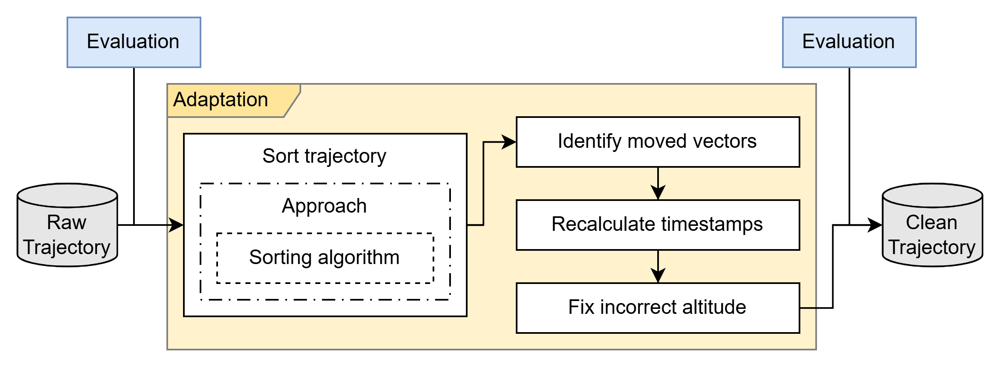

# Enrichment (L3)

<figure>

<figcaption>
Overview of the enrichment pipeline.
</figcaption>
</figure>

## Trajectory sorting

### Modes

- Complete trajectory
- Segmentation by flight phase

### Techniques

#### Nearest neighbours

#### 2-opt and variants

- 2-opt
- Restricted 2-opt
- Progressive 2-opt

#### Distance functions

- Euclidean
- Haversine
- Cost function with directional factor

## Sorting Metrics (JSON)

**Location:** `reports/L3_sort_metrics/sortTray.{date}.{traj_id}.json`

Individual metrics per trajectory.

| Metric | Description |
|--------|-------------|
| `num_flights_initial` | Flights after airport filtering |
| `num_flights` | Flights after removing return flights |
| `returned_flights` | Removed return flights |
| `num_vectors` | Total state vectors processed |
| `num_joined_vectors` | Vectors matched to flights |
| `num_joined_flights` | Flights with matched vectors |
| `num_joined_vectors_final` | Vectors after trajectory filtering |
| `num_joined_flights_final` | Final trajectory count |
| `removed_short_trajectories` | Trajectories below minimum threshold |

---

## Timestamp calculation

## Altitude calculation
