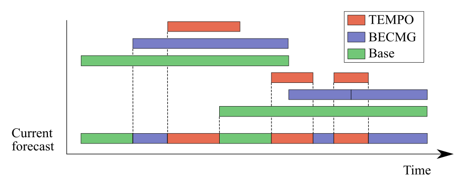

# Data Integration Pipeline (L1 → L2)

This document describes the data integration stage that combines cleaned individual sources (L1) into integrated datasets (L2). The primary output of this stage is the construction of raw 4D trajectories by matching flight metadata (either from Network Manager or Eurocontrol's ADRR) with surveillance observations. Weather data is also consolidated to provide a continuous representation of the forecasted weather conditions at the destination airport.

---

## Network Manager Flight consolidation

Network Manager provides flight information through two complementary data streams that must be merged to create a complete view of each flight:
- **Flight Plans (FPLAN)**: Pre-flight planned information
- **Flight Data (FDATA)**: Operational execution information

### Version Selection

Both FPLAN and FDATA messages are versioned and may be updated multiple times per flight. The most updated information is selected for each category:

- **Flight Plan:** Select the last message per flight (by timestamp)
- **Flight Data:** For TERMINATED flights with multiple updates, select first TERMINATED message (since in some flights later messages ammend the previous, and contain only some attributes); otherwise select latest version.

### Attribute Consolidation

When attributes appear in both sources, the values in FDATA values are preferred over FPLAN values (actual over planned). Consolidated attributes include: `icao24`, `callsign`, `estimatedOffBlockTime`, `aerodromeOfDeparture`, `aerodromeOfDestination`, `operator`, `operatingOperator`, `aircraftType`.

### Temporal Consistency Validation

We have detected some flight ID reutilizations across long periods of time. After merging, flights are filtered to ensure FPLAN and FDATA refer to the same flight:

```python
valid_flights = flights[
    (actualTakeOffTime > estimatedOffBlockTime - 1 day) &
    (actualTimeOfArrival < estimatedOffBlockTime + 2 days)
]
```

## Trajectory construction

Match consolidated flight records with OpenSky state vectors to construct 4D trajectories. Each trajectory consists of:
- Flight metadata (origin, destination, times, identifiers)
- Sequence of state vectors (position, velocity, altitude observations)

Matching these data leverages aircraft or flight identifiers available. In particular, Network Manager enables matching by ICAO24 address and callsign, while ADRR only supports matching by flight callsign. In addition to identifier matching, temporal filtering is also applied to ensure that state vectors are assigned to the correct flight.

To this end, state vectors are filtered based on the reported takeoff and landing times, with a tolerance threshold (`TIME_EXPANSION`) to account for potential desynchronization between data sources and delays in the reception of surveillance data. Flights extracted from ADRR use off-block time instead of takeoff time, since the latter is not available in the dataset.

```python
# NM
matched_vectors = vectors[
    (timestamp >= actualTakeOffTime - TIME_EXPANSION) &
    (timestamp <= actualTimeOfArrival + TIME_EXPANSION)
]

# ADRR
matched_vectors = vectors[
    (timestamp >= actualOffBlockTime - TIME_EXPANSION) &
    (timestamp <= actualTimeOfArrival + TIME_EXPANSION)
]
```

### Processing Flow

1. Load flights with optional airport filtering
2. Remove return flights (same origin and destination)
3. For each state vector file:
   - Load vectors
   - Pre-filter by ICAO24/callsign
   - Join with flights
   - Filter by temporal overlap
   - Accumulate matched vectors
4. Consolidate all matched vectors
5. Filter trajectories with < MIN_VECTOR_NUMBER (200) vectors
6. Write outputs

### Overnight Flight Handling

Flights crossing midnight require loading vectors from both the current date and the next day, as OpenSky vectors are partitioned by date.

### Integration Parameters

Defined in `trajectoryIntegration/params.py`:

| Parameter | Value | Purpose |
|-----------|-------|---------|
| `TIME_EXPANSION` | 600 seconds | Temporal tolerance for vector matching |
| `MIN_VECTOR_NUMBER` | 200 | Minimum vectors required per trajectory |

---


## Integration Metrics (JSON)

**Location:** `reports/L2_integration_metrics/integration.{date}.json`

Aggregated per date.

| Metric | Description |
|--------|-------------|
| `num_vectors_initial` | Total state vectors processed |
| `num_flights_initial` | Flights after airport filtering |
| `num_vectors_joined` | Vectors matched to flights |
| `num_flights_joined` | Flights with matched vectors |
| `num_vectors_final` | Vectors after trajectory filtering |
| `num_flights_final` | Final trajectory count |
| `removed_short_trajectories` | Trajectories below minimum threshold |

---

## Weather conditions

Weather conditions at the airport are continuously evolving: to provide an accurate description of such conditions, it is necessary to keep track of the updates across different forecasts.

TAF reports are published every 6 hours, and provide a forecast describing the following 30 hours. New forecasts can be published in addition to the routine periodicity if the weather conditions change drastically, or if ammendments or corrections have to be made to previous forecasts. Thus, the _current weather forecast_ at the airport is consolidated as follows:

1. Routine forecasts define the _base_ weather conditions for the next 30 hours. 
2. If stable changes (BECMG clauses) are expected to occur, the new conditions superseed the base conditions.
3. If temporal changes (TEMPO clauses), which only last a limited amount of time, are included in the routine report, the temporal conditions superseed any base or stable conditions.
4. The publication of new routine forecasts, corrections (COR reports) and amendments (AMD reports), superseeds all previous forecasts.

<figure><p align="center">
</p>
<figcaption><p align="center">Overview of the cleaning pipeline.</p></figcaption>
</figure>

The validity period of each forecast is calculated according to their type:
1. Base conditions (routine, COR, AMD) are set to be valid up to 30h since the issue time, unless stated otherwise.
2. Stable changes are set to be valid from the moment they occur (`time_from`) up to the validity limit of the report.
3. Temporal changes are valid during the period indicated by `time_from` and `time_to` attributes of the TEMPO clause.

Currently, potential changes (PROB30|40 clauses) are not used to describe weather conditions at the airport.

As a result, the weather at the airport is described by a set of weather conditions that start at a given timestamp, and last until the validity time limit defined for that prevalent weather conditions (that is, until different conditions are forecasted either by changes or new forecasts). 

### Matching between State vectors and weather conditions

Each state vector is assigned the weather conditions that are current at the airport at the timestamp of that vector, that is, the weather conditions which validity period contains the moment the state vector was emmited.
